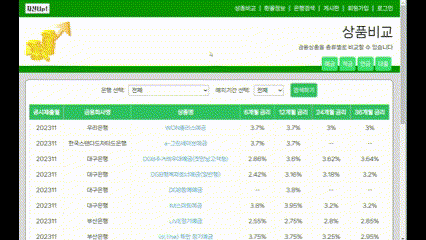
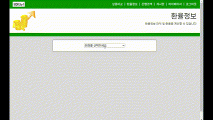
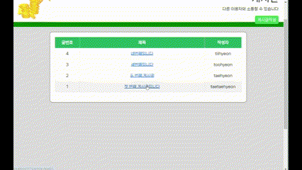
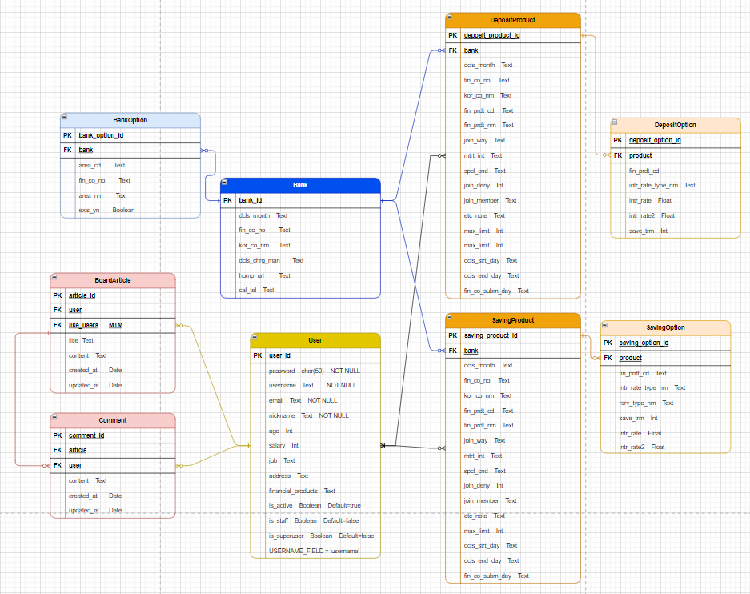
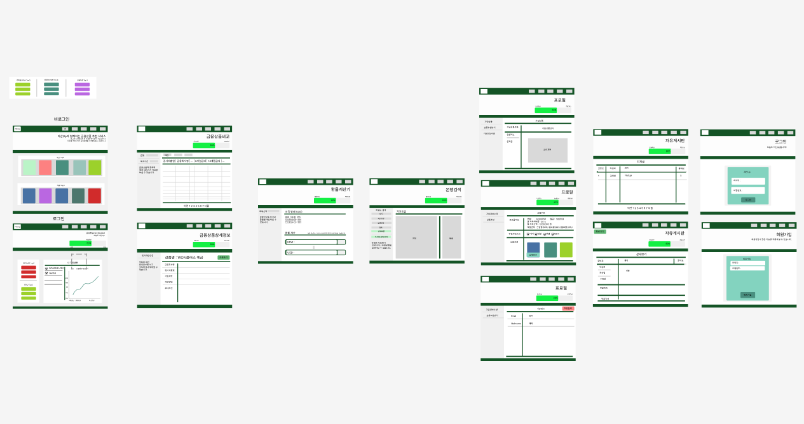

# 금융 상품 비교/추천 웹 애플리케이션 프로젝트

# 목차

1. [**서비스 소개**](#-자산Up)
2. [**기획 배경**](#-기획-배경)
3. [**주요 기능**](#-주요-기능)
4. [**회고록**](#-회고록)
5. [**팀원 소개**](#-팀원-소개)
6. [**기술 스택**](#-기술-스택)
7. [**erd 다이어그램**](#-erd-다이어그램)
8. [**와이어프레임**](#-와이어프레임)

## 💸 자산Up
>
> 금융 상품을 추천하는 알고리즘을 구현한 웹 애플리케이션 개발
>
> 프로젝트 기간 : 2023.11.16 - 2023.11.23 (1주)

## 🌏 기획 배경

### 배경
시중에는 다양한 금융 상품들이 존재하는데, 한 번에 확인을 하거나 내가 어떤 금융 상품들을 가지고 있는지 파악하기가 어려운 상황입니다. 또한 자신의 투자 성향에 대해서 잘 모를 경우 어떠한 금융상품들이 좋은지 비교하기 어려워 구매하기 어려운 실정입니다.

### 문제 해결
금융 상품 비교 웹 애플리케이션을 만들어 문제를 해결할 수 있습니다. 각 금융 기업들의 금융 상품들을 한데 모아 금리별로 비교할 수 있게 만들고, 사용자의 성향(나이, 성별, 연봉, MBTI)에 따라 적합한 금융 상품을 추천받아볼 수 있습니다. 
부가적으로 주요국가들의 환율을 계산하여 환전을 해볼 수 있으며, 사용자 주변의 은행을 검색하거나 원하는 지역을 설정하여 은행 위치를 검색해 수 있습니다.

## 🏦 주요 기능

### 회원가입 및 로그인

- 회원가입을 함과 동시에 바로 로그인이 가능합니다.
- 회원가입을 하며 회원의 기본 정보를 기입할 수 있습니다.

### 메인(비로그인)

- 비로그인 상태의 메인화면입니다.
- 예/적금별 이용량 Top5 상품을 확인할 수 있습니다.
- 상품 상세 정보를 확인할 수 있습니다.

### 메인(로그인)

- 로그인 상태의 메인화면입니다.
- 현재자산부터 목표금액까지 몇%에 도달했는지 나타내주며, 가입한 상품의 금리에 따라 현재 자산이 증가합니다.
- 이용자의 연령/성별, MBTI별 Top3 상품을 확인할 수 있습니다.
- 상품 상세 정보를 확인할 수 있습니다.
- 가입한 상품별로 금리에 따른 금액 상승량을 확인할 수 있습니다.

### 금융상품 비교

- 상품의 유형(예금/적금/연금/대출)별로 금리를 비교하며 상품들을 확인할 수 있습니다.
- 상품 상세 정보를 확인 및 가입할 수 있습니다.

### 환율정보

- 환율을 계산할 수 있습니다.

### 은행검색

- 사용자 주변의 은행을 검색할 수 있습니다.
- 지역별로도 상품이 존재하는 은행을 검색할 수 있습니다.

### 게시판

- 글 작성/수정/삭제 및 댓글 작성/수정/삭제가 가능합니다.

### 상품추천

- 카테고리별로 나이, 성별, 연봉, MBTI이 같은 이용자들이 가입한 금융상품을 추천받을 수 있습니다.
- 상품 상세 정보를 확인 및 가입할 수 있습니다.

## 😄 회고록

- **일정관리의 중요성**
  - 시간적인 제한을 고려하지 못하고, 부가적인 기능에 집중을 많이 했던 것 같습니다. 필수적이고 핵심적인 기능을 우선 구현하고 부가적인 기능은 그 후로 작업의 우선순위를 선정하는 방식으로 프로젝트에 임하는 것이 중요하다는 것을 깨달았습니다.
- **기본의 중요성**
  - 기본적인 틀을 중요시 여기지 않고 자세히 만들지 않으면 추가적인 오류가 발생하기 쉽기 때문에, 간단해 보이는 오류라도 꼭 해결을 하고 넘어가면서 디버깅을 하는 것이 중요하다는 것을 깨달았습니다.
- **정확한 내용을 학습하기**
  - 정확하게 아는 것이 아니라 애매하게 알고 있으면 개발하거나 디버깅시 더 많은 시간을 할애했었습니다. 모르는 부분이 있으면 다시 한 번 더 학습하면서 짚고 넘어갈 필요가 있는 것 같습니다.

## 🤝 팀원 소개

### 김태현 (풀스택, 팀장)
- 전체적인 기획 및 일정 관리 주도
- 전반적인 UI/UX 디자인
- 환율정보 기능, 은행검색 기능, 게시판 기능
### 최현기 (풀스택)
- ERD 설계
- 상품비교 기능, 상품추천 기능, 로그인/회원가입 기능

## 💻 기술 스택

### FrontEnd & BackEnd

### Cooperation

### Tools

### Infra

## 📊 ERD 다이어그램

## 🎨 와이어프레임

